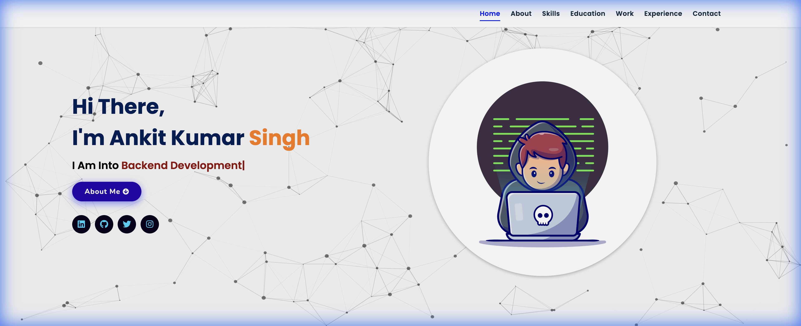
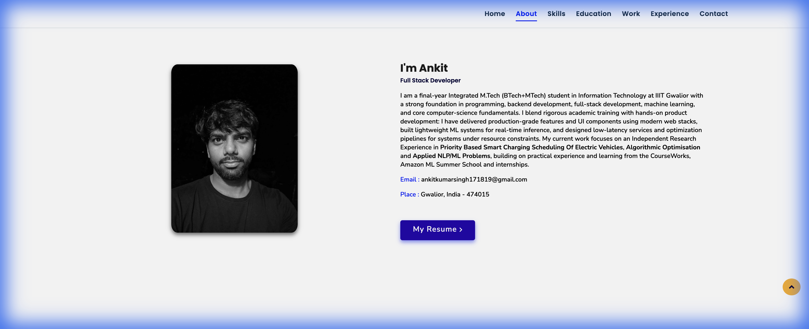
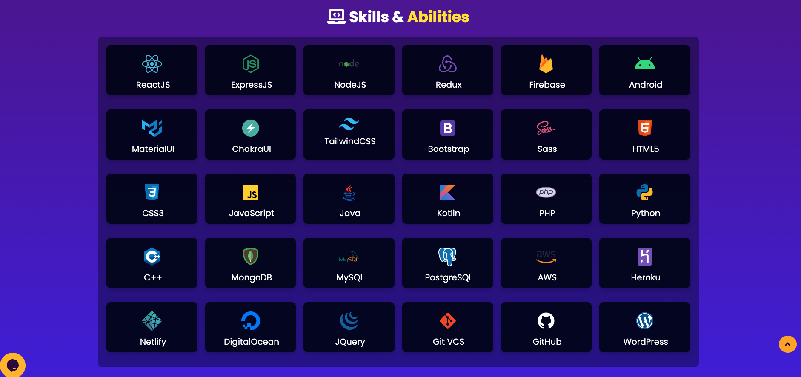
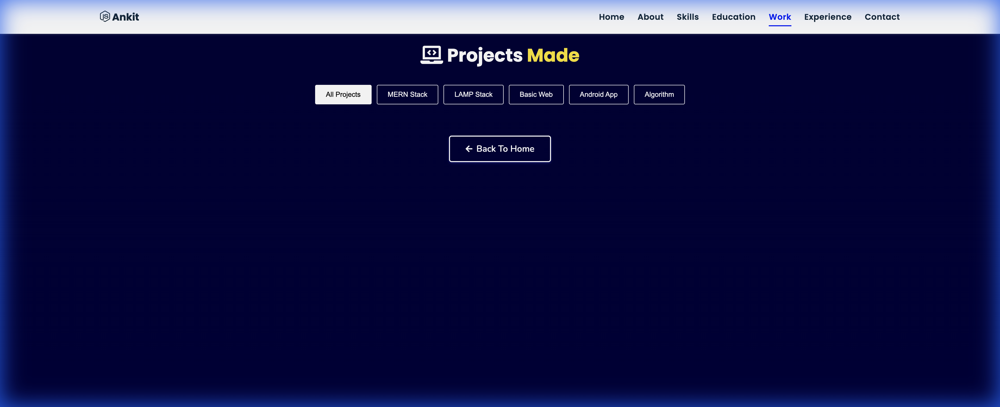
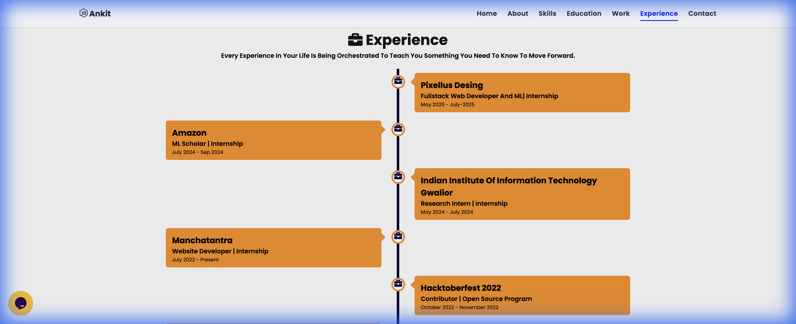
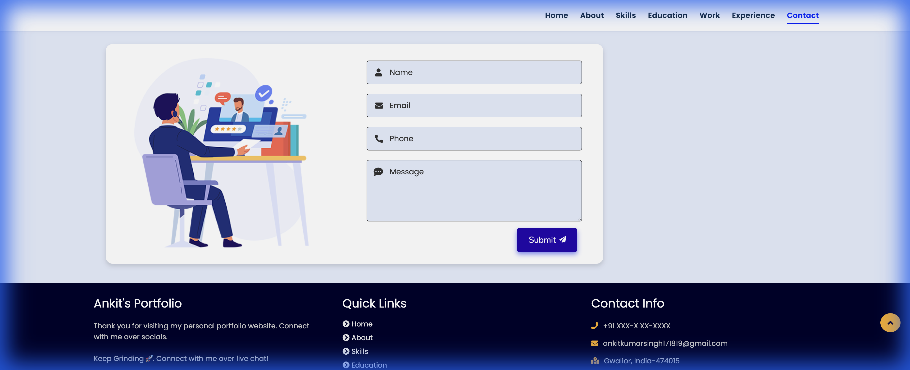

# Portfolio | Ankit Kumar Singh

Welcome to my personal portfolio website! This project showcases my skills, experience, projects, and education in a responsive and interactive web application.

## 🚀 Overview

This portfolio is designed to provide a comprehensive view of my professional background. It features a modern, dynamic user interface with animations and a clean layout to ensure a great user experience across all devices.

## 🛠️ Tech Stack

This project is built using the following technologies:

*   **HTML5**: Structure and semantic markup.
*   **CSS3**: Styling, animations, and responsive design.
*   **JavaScript (ES6+)**: Logic and interactivity.
*   **Libraries & Plugins**:
    *   [jQuery](https://jquery.com/) - DOM manipulation.
    *   [Typed.js](https://github.com/mattboldt/typed.js/) - Typing animation effect.
    *   [Particles.js](https://vincentgarreau.com/particles.js/) - Interactive background particles.
    *   [Vanilla-tilt.js](https://micku7zu.github.io/vanilla-tilt.js/) - 3D tilt effect on elements.
    *   [ScrollReveal](https://scrollrevealjs.org/) - Scroll animations.
    *   [EmailJS](https://www.emailjs.com/) - Contact form functionality.
    *   [Font Awesome](https://fontawesome.com/) - Icons.

## ✨ Features

*   **Responsive Design**: Fully adaptable to different screen sizes (Mobile, Tablet, Desktop).
*   **Interactive Elements**: Engaging hover effects, typing animations, and particle backgrounds.
*   **Dynamic Navigation**: Smooth scrolling and active link highlighting.
*   **Contact Form**: Functional contact form powered by EmailJS.
*   **Project Showcase**: Detailed view of my projects.
*   **Experience Timeline**: Visual representation of my professional journey.

## 📸 Screenshots

### Home


### About Me


### Skills & Abilities


### Projects


### Experience


### Contact


## 🚀 Getting Started

To view this portfolio locally:

1.  Clone the repository:
    ```bash
    git clone https://github.com/codexankitsingh/Portfolio_latest.git
    ```
2.  Navigate to the project directory:
    ```bash
    cd Portfolio_latest
    ```
3.  Open `index.html` in your web browser.

## 📬 Contact

Feel free to reach out to me via the contact form on the website or through my social media handles.

*   **LinkedIn**: [Ankit Kumar Singh](https://www.linkedin.com/in/ankit-kumar-singh-37450422a/)
*   **GitHub**: [codexankitsingh](https://github.com/codexankitsingh)
*   **Email**: ankitkumarsingh171819@gmail.com

---
Designed with ❤️ by Ankit Kumar Singh
